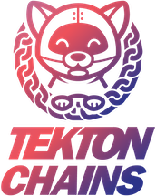

<!--

---
title: "Supply Chain Security"
linkTitle: "Supply Chain Security"
weight: 10
description: Artifact signatures and attestations for Tekton
cascade:
  github_project_repo: https://github.com/tektoncd/chains
---

-->

# Tekton Chains

[](https://bestpractices.coreinfrastructure.org/projects/6408)

Supply Chain Security in Tekton Pipelines

<p align="center">
</img>
</p>

## Getting Started

Tekton Chains is a Kubernetes Custom Resource Definition (CRD) controller that
allows you to manage your supply chain security in Tekton.

In its default mode of operation, Chains works by observing all `TaskRuns`
executions in your cluster. When `TaskRuns` complete, Chains takes a snapshot of
them. Chains then converts this snapshot to one or more standard payload
formats, signs them and stores them somewhere.

Current features include:

- Signing `TaskRun` results with user provided cryptographic keys, including
  `TaskRun`s themselves and OCI Images
- Attestation formats like [intoto](docs/intoto.md)
- Signing with a variety of cryptograhic key types and services (x509, KMS)
- Support for multiple storage backends for signatures

### Installation

Prerequisite: you'll need
[Tekton Pipelines](https://github.com/tektoncd/pipeline/blob/main/docs/install.md)
installed on your cluster before you install Chains.

To install the latest version of Chains to your Kubernetes cluster, run:

```shell
kubectl apply --filename https://storage.googleapis.com/tekton-releases/chains/latest/release.yaml
```

To install a specific version of Chains, run:

```shell
kubectl apply -f https://storage.googleapis.com/tekton-releases/chains/previous/${VERSION}/release.yaml
```

To verify that installation was successful, wait until all Pods have Status
`Running`:

```shell
kubectl get po -n tekton-chains --watch
```

```
NAME                                       READY   STATUS      RESTARTS   AGE
tekton-chains-controller-c4f7c57c4-nrjb2   1/1     Running     0          160m
```

#### Installation on OpenShift

Prerequisite: you'll need
[Tekton Pipelines](https://github.com/tektoncd/pipeline/blob/main/docs/install.md#installing-tekton-pipelines-on-openshift)
installed on your OpenShift cluster before you install Chains.

To install Tekton Chains on OpenShift, you must first apply the `anyuid`
security context constraint to the `tekton-chains-controller` service account.
This is required to run the controller pod. See
[Security Context Constraints](https://docs.openshift.com/container-platform/4.3/authentication/managing-security-context-constraints.html)
for more information.

1. Log on as a user with `cluster-admin` privileges. The following example uses
   the default `system:admin` user:

   ```bash
   oc login -u system:admin
   ```

1. Set up the namespace (project) and configure the service account:

   ```bash
   oc new-project tekton-chains
   oc adm policy add-scc-to-user nonroot -z tekton-chains-controller
   ```

1. Install Tekton Chains:

   ```bash
   oc apply --filename https://storage.googleapis.com/tekton-releases/chains/latest/release.yaml
   ```

   See the
   [OpenShift CLI documentation](https://docs.openshift.com/container-platform/4.3/cli_reference/openshift_cli/getting-started-cli.html)
   for more information on the `oc` command.

1. Monitor the installation using the following command until all components
   show a `Running` status:

   ```bash
   oc get pods --namespace tekton-chains --watch
   ```

### Setup

To finish setting up Chains, please complete the following steps:

- [Add authentication to the Chains controller](docs/authentication.md)
- [Generate a cryptographic key and configure Chains to use it for signing](docs/signing.md)
- [Set up any additional configuration](docs/config.md)

## Tutorials

To get started with Chains, try out our
[getting started tutorial](docs/tutorials/getting-started-tutorial.md).

To start signing OCI images and generating signed provenance for them, try our
[signed provenance tutorial](docs/tutorials/signed-provenance-tutorial.md).

### Community tutorials

The Chains community has been hard at work creating tutorials as well:

- [Dual storage backend setup](https://github.com/thesecuresoftwarefactory/ssf/blob/main/examples/buildpacks/dual-storage-backend.md)
  showcases how to use multiple storage backends and verify the attestations
  with [cosign].

## Experimental Features

To learn more about experimental features, check out
[experimental.md](docs/experimental.md)

## Want to contribute

We are so excited to have you!

- See [CONTRIBUTING.md](CONTRIBUTING.md) for an overview of our processes
- See [DEVELOPMENT.md](DEVELOPMENT.md) for how to get started
- See [ROADMAP.md](ROADMAP.md) for the current roadmap Check out our good first
  issues and our help wanted issues to get started!

To learn more about Chains:

- Chat with us in the [#chains](https://tektoncd.slack.com/messages/chains)
  Slack channel
- Attend the Chains Working Group meeting, details
  [here](https://github.com/tektoncd/community/blob/main/working-groups.md#chains)

[cosign]: (https://github.com/sigstore/cosign)
