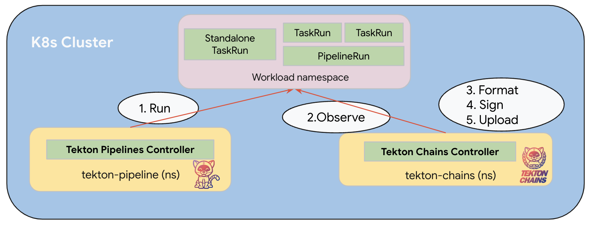

<!--
---
linkTitle: "SLSA Provenance"
weight: 40
---
-->

# SLSA Provenance

## Goal

This doc includes instructions for how to configure a Tekton Pipeline/Task
so that Tekton Chains can generate SLSA provenances properly.

## Glossary

- **_SLSA_**: SLSA stands for Supply-chain Levels for Software Artifacts, or SLSA ("salsa"). It’s a security framework, a checklist of standards and controls to prevent tampering, improve integrity, and secure packages and infrastructure. It’s how you get from "safe enough" to being as resilient as possible, at any link in the chain. ([source](https://slsa.dev/))
- **_Attestation_** ([in-toto attestation](https://github.com/in-toto/attestation/blob/main/spec/README.md)): An in-toto attestation is authenticated metadata about one or more software artifacts. The intended consumers are automated policy engines, such as in-toto-verify and Binary Authorization. There are [a variety of attestations](https://github.com/in-toto/attestation/tree/main/spec/predicates), and the type of attestation is determined by the [predicate](https://github.com/in-toto/attestation/blob/main/spec/v1/predicate.md).
- **_SLSA Provenance_**: [SLSA Provenance](https://slsa.dev/spec/v1.0/provenance) is an attestation that a build platform generated to describe how an artifact or set of artifacts was produced.
- **_Pipeline-level provenance_**: Provenance that Tekton Chains generates to cover the whole picture of the PipelineRun execution.
- **_Task-level provenance_**: Provenance that Tekton Chains generates to only include the details of a particular TaskRun execution. It's particularly needed for a standalone TaskRun that is not spawned by a PipelineRun. By contrast, if it's a child TaskRun of a PipelineRun, Task-level provenance will miss the details of other TaskRuns within that Pipeline.
- **_Input Artifacts_**: A canonical term used in this doc to refer to the artifacts that influenced the build process such as source code repository, dependencies and so on. It's mapped to `resolvedDependences` field in SLSA v1.0, and mapped to `materials` field in SLSA v0.1 & v0.2.
- **_Output Artifacs_**: A canonical term used in this doc to refer to the artifacts that the build process produced i.e. an OCI image. This is mapped to `Subjects` field in all SLSA versions.
- **_`Results`_**: `Results` are Tekton API fields that authors can use to emit some information after a TaskRun/PipelineRun is complete. `Results` can be used to pass along information to different tasks within a pipeline or aggregate different task results to a pipeline result. Check out [Tekton official doc](https://tekton.dev/docs/pipelines/pipelines/#using-results) more information. _Note: API result field is completely different from [Tekton Results Operator](https://tekton.dev/docs/results/)_.
- **_Type hinting_**: Refer to specially named results/params that aim to enable Tekton Chains to understand the input artifacts and outputs of a PipelineRun/TaskRun.

## How does Tekton Chains work?

Tekton Chains works by reconciling the run of a task or a pipeline. Once the run is observed as `completed`, Tekton Chains will take a snapshot of the completed TaskRun/PipelineRun, and start its core works in the order of **_`formatting`_** (generate provenance json) -> **_`signing`_** (sign the payload using the key configured by user) -> **_`uploading`_** (upload the provenance and its signature to the storage configured by user).



## How to configure Tekton Chains

Tekton Chains supports both SLSA v0.2 and v1.0 provenance for both task-level and pipeline-level provenance.

The following shows the mapping between slsa version and formatter name.

| SLSA Version | Formatter Name         |
| ------------ | ---------------------- |
| v1.0         | `slsa/v2alpha3` and `slsa/v2alpha4`        |
| v0.2         | `slsa/v1` or `in-toto` |

To configure Task-level provenance version

```shell
kubectl patch configmap chains-config -n tekton-chains -p='{"data":{"artifacts.taskrun.format": "slsa/v1"}}'
```

To configure Pipeline-level provenance version

```shell
kubectl patch configmap chains-config -n tekton-chains -p='{"data":{"artifacts.pipelinerun.format": "slsa/v1"}}'
```

> Note:\
> While Chains is able to generate both task-level and pipeline-level provenance at the same time, it's not recommended to upload both to a storage backend because it would be confusing to have 2 different provenances for the same artifact.\
> To disable Task-level provenance, simply config empty string `""` as the storage backend
>
> ```shell
> kubectl patch configmap chains-config -n tekton-chains -p='> {"data":{"artifacts.taskrun.storage": ""}}'
> ```
>
> To disable Pipeline-level provenance, simply config empty string `""` as the storage backend
>
> ```shell
> kubectl patch configmap chains-config -n tekton-chains -p='> {"data":{"artifacts.pipelinerun.storage": ""}}'
> ```

## How to configure a Task or Pipeline

As mentioned in the [Glossary](#glossary), SLSA provenance describes the build process of a particular artifact being produced. While Tekton Chains is able to capture the build process regardless of how the pipeline was configured, it is mandatory to signal Chains what the output and input artifacts are in the pipeline config. The way to do that is through the type hinting.

- Task-level Provenance: The type hinting carrying the references of input/output artifacts should be defined in the TaskSpec.
- Pipeline-level Provenance: The type hinting carrying the references of input/output artifacts can be defined either:
  - in the PipelineSpec
  - in the TaskSpec. However, in this case, the feature flag [`artifacts.pipelinerun.enable-deep-inspection`](config.md#pipelinerun-configuration) must be enabled to instruct Chains to dive deep into each child TaskRuns to look for type-hinting.

## Type Hinting

Type hinting is a way to let Chains to understand the input and output artifacts throughout a PipelineRun. Chains expects different type hinting names for inputs and outputs. However, both input and output artifacts should have the uri and digest components, which is the common thing in the following type hinting list.

### Input Artifacts

Input artifacts can be defined either in `params` or `results` using one of following options.

It's worth noting that the value for the digest component needs to be precise commit SHA. It can't be other mutable references i.e. tag, branch name and so on.

#### Git Results

In this approach, one can define the url of the source code repository and the precise commit sha digest in type hinting **_exactly named as `CHAINS-GIT_URL` and `CHAINS-GIT_COMMIT`_** respectively.

<details>
<summary>Example TaskRun</summary>

```yaml
apiVersion: tekton.dev/v1
kind: TaskRun
metadata:
  name: git-clone
spec:
  taskSpec:
    params:
      - name: url
        description: Repository URL to clone from.
        type: string
        default: "https://github.com/tektoncd/pipeline"
      - name: revision
        description: Revision to checkout. (branch, tag, sha, ref, etc...)
        type: string
        default: "main"
    results:
      - name: CHAINS-GIT_URL
        type: string
        description: The precise URL that was fetched by this Task.
      - name: CHAINS-GIT_COMMIT
        type: string
        description: The precise commit SHA that was fetched by this Task.
    steps:
      - name: dummy-clone
        image: bash:latest
        script: |
          #!/usr/bin/env bash
          echo -n "https://github.com/tektoncd/pipeline" | tee $(results.CHAINS-GIT_URL.path)
          echo -n "7f2f46e1b97df36b2b82d1b1d87c81b8b3d21601" | tee $(results.CHAINS-GIT_COMMIT.path)
```

</details>

Note: This can be either params or results.

- **_Param_**: To surface a git URL/commit as the input artifact, add a parameter named `CHAINS-GIT_COMMIT` and `CHAINS-GIT_URL`. The value of these
  parameters should be fed by some VCS task (e.g like this
  [task](https://github.com/tektoncd/catalog/blob/ee409b23543881457c2f35cbd630ea55732b1856/task/git-clone/0.9/git-clone.yaml#L112-L115)) so that the reported url and revision are guaranteed to be the one that was fetched.
  A `PipeLine` example where another task `checkout` has URL/commit as
  task results:

  ```yaml
  - name: build
    params:
      - name: CHAINS-GIT_COMMIT
        value: "$(tasks.checkout.results.commit)"
      - name: CHAINS-GIT_URL
        value: "$(tasks.checkout.results.url)"
  ```

- **_Result_**: Alternatively, `CHAINS-GIT_COMMIT` and `CHAINS-GIT_URL` can be results instead.
  Another `Pipeline` example where results are used:

  ```yaml
  spec:
    results:
      - description: Repository URL used for buiding the image.
        name: CHAINS-GIT_URL
        value: $(tasks.checkout.results.url)
      - description: Repository commit used for building the image.
        name: CHAINS-GIT_COMMIT
        value: $(tasks.checkout.results.commit)
    tasks:
      - name: checkout
  ```

#### `*ARTIFACT_INPUTS`

> Note:\
> `*` indicates any expression

In this approach, one can group the url of the source code repository and the precise commit sha into a single object type hinting. The object type hinting only needs to have the **_suffix `ARTIFACT_INPUTS`_** and have the 2 keys exactly named as `uri` and `digest`. This is particularly useful if there are multiple input artifacts. For example, one object type hinting can be `first_ARTIFACT_INPUTS` and another one is `second_ARTIFACT_INPUTS`.

> Note:
>
> - The digest component must be in the format of `cryptographic hash algorithm name` + `:` + `a valid hex value` i.e. "sha1:7f2f46e1b97df36b2b82d1b1d87c81b8b3d21601".

<details>
<summary>Example TaskRun</summary>

```yaml
apiVersion: tekton.dev/v1
kind: TaskRun
metadata:
  name: git-clone
spec:
  taskSpec:
    params:
      - name: url
        description: Repository URL to clone from.
        type: string
        default: "https://github.com/tektoncd/pipeline"
      - name: revision
        description: Revision to checkout. (branch, tag, sha, ref, etc...)
        type: string
        default: "main"
    results:
      - name: source_repo_ARTIFACT_INPUTS
        description: The source code repo artifact
        type: object
        properties:
          uri: {}
          digest: {}
    steps:
      - name: dummy-clone
        image: bash:latest
        script: |
          #!/usr/bin/env bash
          echo -n "{\"uri\":\"https://github.com/tektoncd/pipeline\", \"digest\":\"sha1:7f2f46e1b97df36b2b82d1b1d87c81b8b3d21601\"}" > $(results.source_repo_ARTIFACT_INPUTS.path)
```

</details>

---

### Output Artifacts

Output artifacts should be defined in `results` only, using one of following options.

#### `*IMAGE_URL` / `*IMAGE_DIGEST`

In this approach, one can write the url and digest of an output OCI artifact into 2 results that have same prefix, but the one for url has suffix `IMAGE_URL` and the one for digest has suffix `IMAGE_DIGEST`.

> Note:
>
> - The `IMAGE_URL` component must be a valid container repository URL.
> - The `IMAGE_DIGEST` component must be in the format of `cryptographic hash algorithm name` + `:` + `a valid hex value` i.e. "sha256:586789aa031fafc7d78a5393cdc772e0b55107ea54bb8bcf3f2cdac6c6da51ee"

<details>
<summary>Example TaskRun</summary>

```yaml
apiVersion: tekton.dev/v1
kind: TaskRun
metadata:
  name: image-build
spec:
  taskSpec:
    results:
      - name: first-image-IMAGE_URL
        type: string
        description: The precise URL of the OCI image built.
      - name: first-image-IMAGE_DIGEST
        type: string
        description: The algorithm and digest of the OCI image built.
    steps:
      - name: dummy-build
        image: bash:latest
        script: |
          #!/usr/bin/env bash
          echo -n "gcr.io/foo/bar" | tee $(results.first-image-IMAGE_URL.path)
          echo -n "sha256:586789aa031fafc7d78a5393cdc772e0b55107ea54bb8bcf3f2cdac6c6da51ee" | tee $(results.first-image-IMAGE_DIGEST.path)
```

</details>

#### `IMAGES`

Multiple images can also be specified by using a single `IMAGES` Result.
The value of the `IMAGES` result is a list of images, each qualified by digest.
The list of images can be separated by commas or by newlines.

<details>
<summary>Example TaskRun</summary>

```yaml
apiVersion: tekton.dev/v1
kind: TaskRun
metadata:
  name: image-build
spec:
  taskSpec:
    results:
      - name: IMAGES
        description: The multiple image artifacts
        type: string
    steps:
      - name: dummy-build
        image: bash:latest
        script: |
          #!/usr/bin/env bash
          echo -n "img1@sha256:digest1, img2@sha256:digest2" | tee $(results.IMAGES.path)
```

</details>

#### `*ARTIFACT_URI` / `*ARTIFACT_DIGEST`

Similar to option 1 - `IMAGE_URL` and `IMAGE_DIGEST`, but just with different names.

#### `*ARTIFACT_OUTPUTS`

In this approach, one can group the url and digest of the output artifact a single object result. The object result only needs to have the **_suffix `ARTIFACT_OUTPUTS`_** and have the 2 keys exactly named as `uri` and `digest`. This is particularly useful if there are multiple artifacts produced throughout a task. For example, one object type hinting can be `first_ARTIFACT_OUTPUTS` and another one is `second_ARTIFACT_OUTPUTS`.

> Note:
>
> - The digest component must be in the format of `cryptographic hash algorithm name` + `:` + `a valid hex value` i.e. "sha256:586789aa031fafc7d78a5393cdc772e0b55107ea54bb8bcf3f2cdac6c6da51ee".

<details>
<summary>Example TaskRun</summary>

```yaml
apiVersion: tekton.dev/v1
kind: TaskRun
metadata:
  name: image-build
spec:
  taskSpec:
    results:
      - name: first-ARTIFACT_OUTPUTS
        description: The first artifact built
        type: object
        properties:
          uri: {}
          digest: {}
    steps:
      - name: dummy-build
        image: bash:latest
        script: |
          #!/usr/bin/env bash
          echo -n "{\"uri\":\"gcr.io/foo/bar\", \"digest\":\"sha256:586789aa031fafc7d78a5393cdc772e0b55107ea54bb8bcf3f2cdac6c6da51ee\"}" > $(results.first-ARTIFACT_OUTPUTS.path)
```

</details>

## `v2alpha4` formatter

Starting with version `v2alpha4`, the type-hinted object results value now can include a new boolean flag called `isBuildArtifact`. When set to `true`, this flag indicates the output artifact should be considered as `subject` in the executed TaskRun/PipelineRun.

The `isBuildArtifact` can be set in results whose type-hint uses the `*ARTIFACT_OUTPUTS` format. Results using the `IMAGES` and `*IMAGE_URL` / `*IMAGE_DIGEST` type-hint format will still be considered as `subject` automatically; all other results will be classified as `byProduct`

For instance, in the following TaskRun:

```yaml
apiVersion: tekton.dev/v1
kind: TaskRun
metadata:
  name: image-build
spec:
  taskSpec:
    results:
      - name: first-ARTIFACT_OUTPUTS
        description: The first artifact built
        type: object
        properties:
          uri: {}
          digest: {}
      
      - name: second-ARTIFACT_OUTPUTS
        description: The second artifact built
        type: object
        properties:
          uri: {}
          digest: {}
          isBuildArtifact: {}
      
      - name: third-IMAGE_URL
        type: string
      - name: third-IMAGE_DIGEST
        type: string

      - name: IMAGES
        type: string
    steps:
      - name: dummy-build
        image: bash:latest
        script: |
          echo -n "{\"uri\":\"gcr.io/foo/img1\", \"digest\":\"sha256:586789aa031fafc7d78a5393cdc772e0b55107ea54bb8bcf3f2cdac6c6da51ee\"}" > $(results.first-ARTIFACT_OUTPUTS.path)

          echo -n "{\"uri\":\"gcr.io/foo/img2\", \"digest\":\"sha256:05f95b26ed10668b7183c1e2da98610e91372fa9f510046d4ce5812addad86b5\", \"isBuildArtifact\":\"true\"}" > $(results.second-ARTIFACT_OUTPUTS.path)

          echo -n "gcr.io/foo/bar" | tee $(results.third-IMAGE_URL.path)
          echo -n "sha256:05f95b26ed10668b7183c1e2da98610e91372fa9f510046d4ce5812addad86b6" | tee $(results.third-IMAGE_DIGEST.path)

          echo -n "gcr.io/test/img3@sha256:2996854378975c2f8011ddf0526975d1aaf1790b404da7aad4bf25293055bc8b, gcr.io/test/img4@sha256:ef334b5d9704da9b325ed6d4e3e5327863847e2da6d43f81831fd1decbdb2213" | tee $(results.IMAGES.path)
```

`second-ARTIFACT_OUTPUTS`, `third-IMAGE_URL`/`third-IMAGE_DIGEST`, and `IMAGES` will be considered as `subject`. `first-ARTIFACT_OUTPUTS` doesn't specify `isBuildArtifact: true` so it is not count as `subject`.

Chains' `v2alpha4` formatter now automatically reads type-hinted results from StepActions associated to the executed TaskRun/PipelineRun; users no longer need to manually surface these results from the StepActions when the appropriate type hints are in place. PipelineRuns require `artifacts.pipelinerun.enable-deep-inspection: true` for this functionality to work. For instance, with the following TaskRun:

```yaml
apiVersion: tekton.dev/v1alpha1
kind: StepAction
metadata:
  name: img-builder
spec:
  image: busybox:glibc

  results:
    - name: first-ARTIFACT_OUTPUTS
      description: The first artifact built
      type: object
      properties:
        uri: {}
        digest: {}
        isBuildArtifact: {}

    - name: second-IMAGE_URL
      type: string
    - name: second-IMAGE_DIGEST
      type: string

  script: |
    echo -n "{\"uri\":\"gcr.io/foo/img1\", \"digest\":\"sha256:586789aa031fafc7d78a5393cdc772e0b55107ea54bb8bcf3f2cdac6c6da51ee\", \"isBuildArtifact\": \"true\" }" > $(step.results.first-ARTIFACT_OUTPUTS.path)

    echo -n "gcr.io/foo/bar" > $(step.results.second-IMAGE_URL.path)
    echo -n "sha256:05f95b26ed10668b7183c1e2da98610e91372fa9f510046d4ce5812addad86b6" > $(step.results.second-IMAGE_DIGEST.path)
---
apiVersion: tekton.dev/v1
kind: TaskRun
metadata:
  name: taskrun
spec:
  taskSpec:
    steps:
      - name: action-runner
        ref:
          name: img-builder
```

Chains Will read `first-ARTIFACT_OUTPUTS` and `second-IMAGE_URL/second-IMAGE_DIGEST` from the StepAction and classify them as a `subject`.


## Besides inputs/outputs

Tekton Chains is also able to capture the feature flags being used for Tekton Pipelines controller and the origin of the build configuration file with immutable references such as task.yaml and pipeline.yaml. However, those fields in Tekton Pipelines are gated by a dedicated feature flag. Therefore, the feature flag needs to be enabled to let Tekton Pipelines controller to populate these fields.

```shell
kubectl patch -n tekton-pipelines configmap feature-flags -p '{"data":{"enable-provenance-in-status":"true"}}'
```
