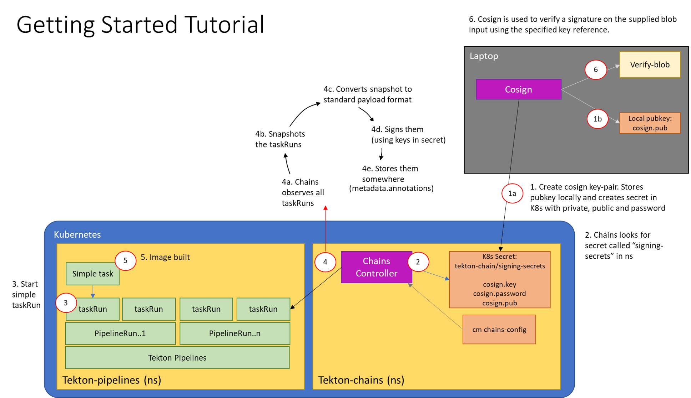

<!--
---
linkTitle: "Tutorial: Getting Started"
weight: 100
---
-->

# Chains Getting Started Tutorial

This tutorial will guide you through:

* Generating your own keypair and storing it as a Kubernetes Secret
* Configuring Tekton Chains backend storage
* Creating a sample TaskRun
* Retrieving the signature and payload from the signed TaskRun
* Verifying the signature

We will be creating a `TaskRun`, signing it, and storing the signature and the
payload as annotations on the `TaskRun` itself. So, no additional authentication
should be required!

For this tutorial we will use the [x509](#x509) key type.

## x509

To generate your own encrypted x509 keypair and save it as a Kubernetes secret,
install [cosign] and run the following:

```shell
cosign generate-key-pair k8s://tekton-chains/signing-secrets
```

[cosign] will prompt you for a password, which will be stored in a Kubernetes
secret named signing-secrets in the tekton-chains namespace.

## Configuring Tekton Chains

You will need to make sure that OCI storage is disabled and that the taskrun
storage and format is set to `tekton`.

You can set these fields by running the following command:

```shell
kubectl patch configmap chains-config -n tekton-chains -p='{"data":{"artifacts.oci.storage": "", "artifacts.taskrun.format":"tekton", "artifacts.taskrun.storage": "tekton"}}'
```

Then restart the controller to ensure it picks up the changes:

```shell
kubectl delete po -n tekton-chains -l app=tekton-chains-controller
```

This tells Chains to use the default `tekton` artifact (enabled by default) and
disable the `OCI` artifact.

To create a simple `TaskRun`, run:

```shell
$ kubectl create -f https://raw.githubusercontent.com/tektoncd/chains/main/examples/taskruns/task-output-image.yaml
taskrun.tekton.dev/build-push-run-output-image-qbjvh created
```

Wait for it to finish (all the steps should be marked as **Completed**).

```shell
$ tkn tr describe --last

[...truncated output...]

🦶 Steps

NAME                            STATUS
∙ create-dir-builtimage-9467f   Completed
∙ git-source-sourcerepo-p2sk8   Completed
∙ build-and-push                Completed
∙ echo                          Completed
∙ image-digest-exporter-xlkn7   Completed
```

Next, retrieve the signature and payload from the object (they are stored as
base64-encoded annotations):

```shell
export TASKRUN_UID=$(tkn tr describe --last -o  jsonpath='{.metadata.uid}')
tkn tr describe --last -o jsonpath="{.metadata.annotations.chains\.tekton\.dev/signature-taskrun-$TASKRUN_UID}" > signature
tkn tr describe --last -o jsonpath="{.metadata.annotations.chains\.tekton\.dev/payload-taskrun-$TASKRUN_UID}" | base64 -d > payload
```

Finally, we can check the signature with [cosign]:

```shell
$ cosign verify-blob --key k8s://tekton-chains/signing-secrets --signature ./signature ./payload
Verified OK
```

Now we have a verifiable record of the `TaskRun`!

## What you just created

This diagram shows what you just deployed:



[cosign]: https://github.com/sigstore/cosign
