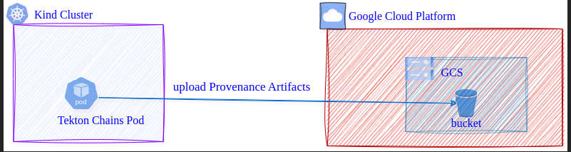
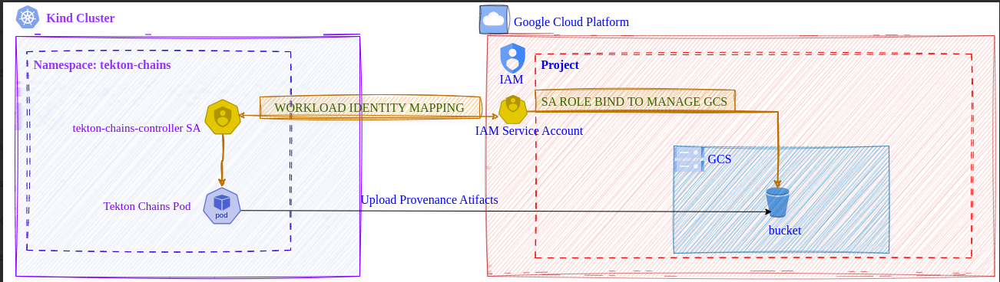

<!--
---
linkTitle: "Tutorial: Store Signed Provenance artifacts in GCS"
weight: 200
---
-->

# Using Google Cloud Storage (GCS) as the storage for Tekton Chains signed artifacts

This tutorial will guide you through the steps to enable the artifacts generated by Tekton Chains running on a Kind cluster to be uploaded to a GCS bucket.

## Scope of the Tutorial



Before you begin, ensure that you have the following tools installed on your machine:

* [kind](https://kind.sigs.k8s.io/docs/user/quick-start/#installation): To create and manage the local Kubernetes cluster.
* [gcloud](https://cloud.google.com/sdk/docs/install): To interact with Google Cloud resources, such as GCS and IAM.
* [cosign](https://docs.sigstore.dev/cosign/system_config/installation/): To sign and verify artifacts (if required).

## Solution Overview

Configure Workload Identity Federation with the Kuberenetes cluster. For detailed instructions follow documentation [here](https://cloud.google.com/iam/docs/workload-identity-federation-with-kubernetes#kubernetes).

Kubernetes can project service account tokens into workloads using projected volumes. By enabling Workload Identity Federation, we allow these tokens to be used by workloads to authenticate with Google Cloud services. This eliminates the need to hardcode keys or store sensitive credentials for authentication. In our case, the `tekton-chains-controller` deployment running on the kind cluster must be configured to mount the projected service account token volume to use these tokens.

The following diagram illustrates the steps we will take.



## Prerequisites

1. **Google Cloud Project** linked to a Billing Account. If you do not have one, you can create a new project following the documentation [here](https://cloud.google.com/resource-manager/docs/creating-managing-projects).

```shell
gcloud auth login

gcloud projects create tekton-chains-project
```
 Ensure that the project is linked to a valid Billing Account.This can be done from console or from CLI. Refer docs.
```shell
gcloud config set project tekton-chains-project
```

2. **Google Cloud Storage (GCS) Bucket** - You will need a bucket to which the artifacts will be uploaded. You can create a new GCS bucket using the following command

```shell
gcloud storage buckets create gs://tekton_artifacts --location=us-central1
```


3. **Kubernetes cluster** to deploy Tekton pipelines and chains
```shell
kind create cluster -n tekton
```

4. Install **Tekton Pipelines** and **Tekton Chains**
```shell
kubectl apply --filename https://infra.tekton.dev/tekton-releases/pipeline/latest/release.yaml
kubectl apply --filename https://infra.tekton.dev/tekton-releases/chains/latest/release.yaml
```
Ensure that all pods in the `tekton-pipelines` and `tekton-chains` namespaces are running, and that the pods are in the "Running" status. Below is an example of what the pods should look like:

```
tekton-chains                tekton-chains-controller-658dbffcd4-cqqxj           1/1     Running   0          69s
tekton-pipelines             tekton-events-controller-fcdb69895-m4xjn            1/1     Running   0          2m14s
tekton-pipelines             tekton-pipelines-controller-77fb6d9c6c-lkbkp        1/1     Running   0          2m14s
tekton-pipelines             tekton-pipelines-webhook-6f69779d47-j5lkx           1/1     Running   0          2m14s
```

## This tutorial will be divided into 6 stages

1. Enable required api service and create a Workload Identity Pool and Provider in GCP
2. Create a Google Cloud IAM service Account and grant GCS Object admin role 
3. Configure GCP Workload Identity Federation
4. Grant access to kubernetes workload
5. Update Chains configuration to enable GCS storage
6. Execute a task and verify artifact storage in GCS bucket

### Stage-1: Create Workload Identity Pool and Provider

Ensure folloiwng services are enabled in the gcloud project
```shell
gcloud services enable iam.googleapis.com
gcloud services enable cloudresourcemanager.googleapis.com
gcloud services enable iamcredentials.googleapis.com
gcloud services enable sts.googleapis.com
```

Create the workload identity pool named `kind-tekton-demo-pool`
```shell
gcloud iam workload-identity-pools create kind-tekton-demo-pool --location="global" --description="BYO-workload identity demo" --display-name="Bare Metal Kind Cluster Pool"
```
Add the OIDC provider corresponding to the Kind cluster to the pool.

First, retrieve the JSON Web Key Set (JWKS) from the Kubernetes API server. JWKS is typically used in OpenID Connect (OIDC) scenarios to validate tokens.
```shell
kubectl get --raw /openid/v1/jwks > cluster-jwks.json
```
Get the issuer uri for the kind cluster using
```shell
kubectl get --raw /.well-known/openid-configuration | jq -r .issuer
```
For a kind cluster the uri would be:
```
https://kubernetes.default.svc.cluster.local
```
Then add the provider to the pool created. use the json and uri obtained in previous steps for the folloiwng command
```shell
gcloud iam workload-identity-pools providers create-oidc kind-cluster-provider \
  --location="global" \
  --workload-identity-pool="kind-tekton-demo-pool" \
  --issuer-uri="https://kubernetes.default.svc.cluster.local" \
  --attribute-mapping="google.subject=assertion.sub,attribute.namespace=assertion['kubernetes.io']['namespace'],attribute.service_account_name=assertion['kubernetes.io']['serviceaccount']['name'],attribute.pod=assertion['kubernetes.io']['pod']['name']" \
  --attribute-condition="assertion['kubernetes.io']['namespace'] in ['tekton-chains']" \
  --jwk-json-path="cluster-jwks.json"
``` 

> **Important**: In the above command please note that the `--attribute-condition` is set to allow uploads from workloads/pods in `tekton-chains` namesapce only. If chains pod is running in someother namespace the condition should be updated.

### Stage-2: Create a Google Cloud IAM service Account and grant GCS Object admin role

Create a Gcloud IAM service account. In this tutorial, we will use the name `gcp-sa-for-kind`, but feel free to choose a different name if you prefer. Just ensure to update the name in the subsequent commands accordingly.

```shell
gcloud iam service-accounts create gcp-sa-for-kind
```

Grant the IAM service account access to resources that we want the Kubernetes workload to access. In this tutorial the kind workload i.e the chains pod has to upload to a gcs bucket. Hence we will bind to role `storage.objectAdmin`, which provides full control over the objects (files) within a GCS bucket, which includes both read and write access. **Note**:Setting up the correct GCS permissions is up to the user. For the scope of tutorial we are restricting to `objectAdmin`.

```shell
export PROJECT_NUMBER=$(gcloud projects describe $(gcloud config get-value project) --format='value(projectNumber)')
export SERVICE_ACCOUNT_EMAIL=$(gcloud iam service-accounts list --filter="name:gcp-sa-for-kind" --format='value(email)')
gcloud projects add-iam-policy-binding ${PROJECT_NUMBER} \
  --member="serviceAccount:${SERVICE_ACCOUNT_EMAIL}" \
  --role="roles/storage.objectAdmin"
```

### Stage-3: Configure GCP Workload Identity Federation

```shell
export PROJECT_NUMBER=$(gcloud projects describe $(gcloud config get-value project) --format='value(projectNumber)')
export SERVICE_ACCOUNT_EMAIL=$(gcloud iam service-accounts list --filter="name:gcp-sa-for-kind" --format='value(email)')
export SUBJECT="system:serviceaccount:tekton-chains:tekton-chains-controller"
export POOL_ID=$(gcloud iam workload-identity-pools list --location=global --format="value(name.basename())") 
export PROVIDER_ID=$(gcloud iam workload-identity-pools providers list --workload-identity-pool=${POOL_ID} --location=global --format="value(name.basename())")
```
> **WARN**: command for POOL_ID works only if there is one pool. If the 
project has multiple pools, then set the pool name directly from the pool creation step in Stage-1

Now we need to bind a policy to the IAM service account to allow it to use the workload Identity Federation and allow specify that the tekton-chains service account `tekton-chains-controller` can access the IAM service account.

```shell
gcloud iam service-accounts add-iam-policy-binding ${SERVICE_ACCOUNT_EMAIL} \
--role="roles/iam.workloadIdentityUser" \
--member="principal://iam.googleapis.com/projects/${PROJECT_NUMBER}/locations/global/workloadIdentityPools/${POOL_ID}/subject/${SUBJECT}"
```

### Stage-4: Grant access to the Kuberenetes workload

Now that the configuration on GCP is complete, we need to configure the Kind cluster's `tekton-chains-controller` service account with the credentials to access GCS resources.

To do this, we need to create a credential configuration file using the following command:

```shell
gcloud iam workload-identity-pools create-cred-config \
projects/${PROJECT_NUMBER}/locations/global/workloadIdentityPools/${POOL_ID}/providers/${PROVIDER_ID} \
--service-account=${SERVICE_ACCOUNT_EMAIL} \
--credential-source-file=/var/run/service-account/token \
--credential-source-type=text \
--output-file=credential-configuration.json
```

This will generate a credential configuration file, enabling the service account to access the GCS resources.

> To ensure the `tekton-chains-controller` service account can access the necessary GCS resources, store the credential configuration in a ConfigMap. Then, we can volume-mount the ConfigMap onto the `tekton-chains-controller` deployment to make the configuration available to the workload.

```shell
kubectl create configmap kind-demo-wid-test --from-file credential-configuration.json --namespace tekton-chains  
```

> **Note**: We need to edit the chains deployment to include the configmap volume mount, corresponding volume and an environment variable. Below is the sample patch deployment for `tekton-chains-controller` with volume Mounts -`workload-identity-credential-configuration`,`token`; volumes - `workload-identity-credential-configuration`,`token` and an env variable `GOOGLE_APPLICATION_CREDENTAILS`. 

```shell
kubectl patch deployment tekton-chains-controller -n tekton-chains --type='strategic' -p '
spec:
  template:
    spec:
      containers:
      - name: tekton-chains-controller
        env:
        - name: GOOGLE_APPLICATION_CREDENTIALS
          value: /etc/workload-identity/credential-configuration.json
        volumeMounts:
        - mountPath: /var/run/service-account
          name: token
          readOnly: true
        - mountPath: /etc/workload-identity
          name: workload-identity-credential-configuration
          readOnly: true
      volumes:
      - name: token
        projected:
          defaultMode: 420
          sources:
          - serviceAccountToken:
              audience: https://iam.googleapis.com/projects/<PROJECT_NUMBER>/locations/global/workloadIdentityPools/<POOL_NAME>/providers/<PROVIDER_ID>
              expirationSeconds: 3600
              path: token
      - name: workload-identity-credential-configuration
        configMap:
          defaultMode: 420
          name: kind-demo-wid-test
'
```
> **!IMP** Ensure to replace the `PROJECT_NUMBER`,`POOL_NAME`,`PROVIDER_ID` in the`serviceAccountToken.audience` corresponding to the `token` volume spec.

With the updated deployment ensure that the chains controller pod is running and the logs do not have any error

### Stage-5. Update Chains configuration to enable GCS storage

```shell
kubectl patch configmap chains-config -n tekton-chains -p='{"data":{"artifacts.taskrun.format": "slsa/v1"}}'
kubectl patch configmap chains-config -n tekton-chains -p='{"data":{"artifacts.taskrun.storage": "gcs"}}'
kubectl patch configmap chains-config -n tekton-chains -p='{"data":{"artifacts.oci.storage": "gcs"}}'
kubectl patch configmap chains-config -n tekton-chains -p='{"data":{"transparency.enabled": "true"}}'
kubectl patch configmap chains-config -n tekton-chains -p='{"data":{"storage.gcs.bucket": "tekton_artifacts"}}'
```

The chains pod will automatically pick the changes done to the configmap. This can be verified in the `tekton-chains-controller` pod logs.

### Stage-6. Execute a task and verify artifact storage in GCS bucket

Great, now that the setup is done we're finally ready to build an image with kaniko!

First, apply the [Kaniko Task](../../examples/kaniko/kaniko.yaml) to your cluster:

```shell
kubectl apply -f examples/kaniko/kaniko.yaml
```

and set the following environment variables:

```shell
export REGISTRY=[The registry you will be pushing to]
```

Assuming that kaniko task is executed from `default` namespace and the task by default uses the `default` service account to push the image to `REGISTRY`, set the following environment variables

```shell
export SERVICE_ACCOUNT_NAME=default
export NAMESPACE=default

docker login $REGISTRY #This helps to generate the dockerconfig locally at $HOME/.docker/config.json. Optional step in case we have the json handy

export DOCKERCONFIG_FILE_PATH=$HOME/.docker/config.json
kubectl create secret generic docker-registry --from-file=.dockerconfigjson=$DOCKERCONFIG_FILE_PATH --type=kubernetes.io/dockerconfigjson -n $NAMESPACE
kubectl patch serviceaccount $SERVICE_ACCOUNT_NAME -p "{\"secrets\": [{\"name\": \"docker-registry\"}]}" -n $NAMESPACE
export DOCKERCONFIG_SECRET_NAME=test-kaniko
kubectl create secret generic $DOCKERCONFIG_SECRET_NAME --from-file $DOCKERCONFIG_FILE_PATH
```

For signing purposes, you can generate a Cosign key pair and store the private key in a Kubernetes secret, while the public key (needed for verifying artifacts) will be stored in the local working directory.

To generate the key pair, use the following command:

```shell
cosign generate-key-pair k8s://tekton-chains/signing-secrets
```

Then, you can start the Kaniko Task with the Tekton CLI tool, [tkn](https://github.com/tektoncd/cli):

```shell
tkn task start --param IMAGE=$REGISTRY/kaniko-chains --use-param-defaults --workspace name=source,emptyDir="" --workspace name=dockerconfig,secret=$DOCKERCONFIG_SECRET_NAME kaniko-chains
```

You can watch the logs of this Task until they complete; if authentication is set up correctly than the final image should be pushed to `$REGISTRY/kaniko-chains` & the signed artifacts and attestation should be uploaded to the gcs bucket - `tekton_artifacts`.

Once the task run is succeeded the uploaded gcloud artifacts can be listed using the following command:
```
gcloud storage objects list gs://tekton_artifacts/** --format="json(name)"
```

Sample output for reference:
```json
[
  {
    "name": "taskrun-default-kaniko-chains-run-zflcs/28998e6f75e5.cert"
  },
  {
    "name": "taskrun-default-kaniko-chains-run-zflcs/28998e6f75e5.chain"
  },
  {
    "name": "taskrun-default-kaniko-chains-run-zflcs/28998e6f75e5.payload"
  },
  {
    "name": "taskrun-default-kaniko-chains-run-zflcs/28998e6f75e5.signature"
  },
  {
    "name": "taskrun-default-kaniko-chains-run-zflcs/taskrun-65c59603-749f-4945-bcb0-821a2ae24e81.cert"
  },
  {
    "name": "taskrun-default-kaniko-chains-run-zflcs/taskrun-65c59603-749f-4945-bcb0-821a2ae24e81.chain"
  },
  {
    "name": "taskrun-default-kaniko-chains-run-zflcs/taskrun-65c59603-749f-4945-bcb0-821a2ae24e81.payload"
  },
  {
    "name": "taskrun-default-kaniko-chains-run-zflcs/taskrun-65c59603-749f-4945-bcb0-821a2ae24e81.signature"
  }
]
```

The .signature file can be downloaded to the current local directory and verified with cosign

```shell
gcloud storage cp "gs://tekton_artifacts/taskrun-default-kaniko-chains-run-zflcs/taskrun-65c59603-749f-4945-bcb0-821a2ae24e81.signature" .
```

The resulting file could be verified with the following cosign command

```shell
cosign verify-blob-attestation --insecure-ignore-tlog --key k8s://tekton-chains/signing-secrets --signature taskrun-65c59603-749f-4945-bcb0-821a2ae24e81.signature --type slsaprovenance --check-claims=false /dev/null
```

Sample output for reference:

```shell
Verified OK
```
