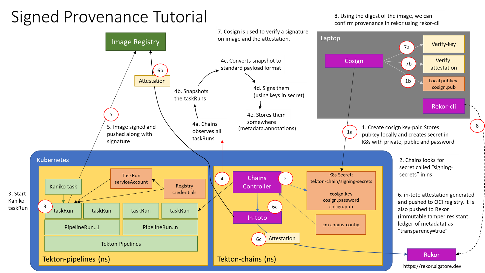

<!--
---
linkTitle: "Tutorial: Signed Provenance"
weight: 200
---
-->

# Chains Signed Provenance Tutorial

This tutorial will cover how to set up Chains to sign OCI images built in Tekton, and how to automatically generate and sign in-toto attestations for each image.
This tutorial will also cover how to store these attestations in a transparency log and query the log for the attestation.

This tutorial will guide you through:

* Generating your own keypair and storing it as a Kubernetes Secret
* Setting up authentication for your OCI registry to store images, image signatures and signed image attestations
* Configuring Tekton Chains to generate and sign provenance
* Building an image with kaniko in a Tekton TaskRun
* Verifying the signed image and the signed provenance

## Prerequisites

A Kubernetes cluster with the following installed:

* Tekton Chains
* Tekton Pipelines

## Generate a Key Pair

First, we'll generate an encrypted x509 keypair and save it as a Kubernetes secret.
Install [cosign](https://github.com/sigstore/cosign) and run the following:

```shell
cosign generate-key-pair k8s://tekton-chains/signing-secrets
```

cosign will prompt you for a password, which will be stored in a Kubernetes secret named `signing-secrets` in the `tekton-chains` namespace.

The public key will be written to a local file called `cosign.pub`.

## Set up Authentication

There are two forms of authentication that need to be set up:
1. The Chains controller will be pushing signatures to an OCI registry using the credentials linked to your `TaskRun`'s service account. See our [authentication doc](../authentication.md)
2. The Kaniko Task that will build and push the image needs push permissions for your registry.

To set up auth for the Kaniko Task, you'll need a Kubernetes secret of a docker `config.json` file which contains the required auth.
You can create the secret by running:

```shell
kubectl create secret generic [DOCKERCONFIG_SECRET_NAME] --from-file [PATH TO CONFIG.JSON]
```

## Configuring Tekton Chains

You'll need to make these changes to the Tekton Chains Config:

* `artifacts.taskrun.format=in-toto`
* `artifacts.taskrun.storage=oci`
* `transparency.enabled=true`

You can set these fields by running

```shell
kubectl patch configmap chains-config -n tekton-chains -p='{"data":{"artifacts.taskrun.format": "in-toto"}}'
kubectl patch configmap chains-config -n tekton-chains -p='{"data":{"artifacts.taskrun.storage": "oci"}}'
kubectl patch configmap chains-config -n tekton-chains -p='{"data":{"transparency.enabled": "true"}}'
```

This tells Chains to generate an in-toto attestation and store it in the specified OCI registry.
Attestations will also be stored in [rekor](https://github.com/sigstore/rekor) since transparency is enabled.

## Start the Kaniko Task

Great, now that the setup is done we're finally ready to build an image with kaniko!

First, apply the [Kaniko Task](../../examples/kaniko/kaniko.yaml) to your cluster:

```shell
kubectl apply -f examples/kaniko/kaniko.yaml
```

and set the following environment variables:

```shell
REGISTRY=[The registry you'll be pushing to]
DOCKERCONFIG_SECRET_NAME=[The name of the secret with the docker config.json]
```

Then, you can start the Kaniko Task with the Tekton CLI tool, [tkn](https://github.com/tektoncd/cli):

```shell
tkn task start --param IMAGE=$REGISTRY/kaniko-chains --use-param-defaults --workspace name=source,emptyDir="" --workspace name=dockerconfig,secret=$DOCKERCONFIG_SECRET_NAME kaniko-chains
```

You can watch the logs of this Task until they complete; if authentication is set up correctly than the final image should be pushed to `$REGISTRY/kaniko-chains`.

## Verifying the Image and Attestation

Once the TaskRun has successfully completed, you'll need to wait a few seconds for Chains to generate provenance and sign it.

Once you see the `chains.tekton.dev/signed=true` annotation on your TaskRun you know that Chains has completed the signing process and you're ready to move on to verification:

```shell
kubectl get tr [TASKRUN_NAME] -o json | jq -r .metadata.annotations

{
  "chains.tekton.dev/signed": "true",
  ...
}
```

To verify the image and the attestation, we'll use `cosign` again:

```shell
cosign verify -key cosign.pub $REGISTRY/kaniko-chains
cosign verify-attestation -key cosign.pub $REGISTRY/kaniko-chains
```

You should see verification output for both!

## Finding Provenance in Rekor

To find provenance for the image in Rekor, first get the digest of the `$REGISTRY/kaniko-chains` image you just built.
You can look this up in the TaskRun, or pull the image to get the digest. 

You can then search rekor to find all entries that match the sha256 digest of the image you just built with the [rekor-cli](https://github.com/sigstore/rekor/releases/) tool:

```shell
rekor-cli search --sha [IMAGE_DIGEST]

[UUID1]
[UUID2]
```

The search will print out the UUIDs of matching entries.
It may take a little guessing, but one of those UUIDs holds the attestation.
You can see the attestation by using [jq](https://github.com/stedolan/jq):

```shell
rekor-cli get --uuid [UUID] --format json | jq -r .Attestation | base64 --decode | jq
```

Congratulations! You have officially built an image, signed it, and generated signed provenance for it with Tekton Chains 🎉

## What you just created
This diagram shows what you just deployed:


